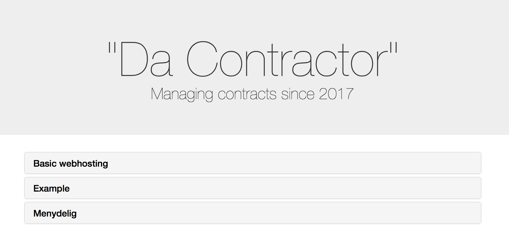

# Da Contractor





## Installation
Run the following with composer and bower:

```bash
composer install
bower install
```

### Your signature
If you want to put your signature as a png file with a white/transparent background in the public folder: ```public/signature.png```. This will then get pasted on the first signature line.

### Web setup
It's up to you whether you want to clone the repo directly into a folder accessible from localhost, start a web server just for this folder or symlink /public to your central www root. It was built using a MAMP installation and a symlink.

### Environment variables
Copy .env.example to .env and add relevant values.
